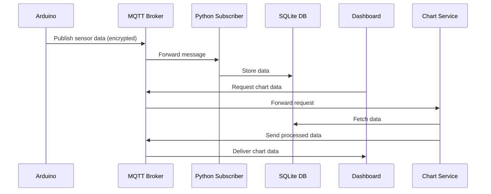

# IoT-Based Home Security Monitoring System

## Project Overview
This project presents the design and implementation of an IoT-based home security monitoring system. The system detects potential hazards in a residential environment and transmits real-life sensor data using the MQTT communication protocol.

The final solution uses Arduino-based hardware, MQTT messaging, a Python backend, and an SQLite database to create a functional prototype.

## Project Methodology
The project was developed using the Agile methodology. Agile was selected due to its flexibility, adaptability, and continuous improvement. It allows integrating changes during development, coding, and testing stages, and effective system maintainability. The iterative approach allows gradual integration of hardware components, MQTT communication, and backend data processing. 

## Project Components

### Hardware
- Arduino Uno microcontroller  
- Solu SL067 Water Level Sensor  
- KY-026 Flame Sensor Module  
- LDR Light Sensor Module (LM393-based)  
- MQ-6 Gas Sensor  
- Scaled physical room prototype for testing   

## MQTT Configuration
- Broker: broker.hivemq.com  
- Port: 8883 (TLS)  
- Topic structure: smarthome/security/sensors/#  

## Arduino UNO Sensor Monitoring System

### Sensors
- Flame sensor (A0)  
- Gas sensor (A1)  
- Water sensor (A2)  
- Light sensor (Digital pin 2)  

The system outputs sensor values in JSON format every 2 seconds via Serial.

## 1. Data Encryption
Sensor data transmitted via MQTT is secured using AES-256-GCM encryption to ensure privacy and prevent unauthorised access. The encryption module processes JSON payloads before publishing to the MQTT broker. It allows data integrity and confidentiality in real-time communications. Each message uses a newly generated random 16-byte nonce: Base64(nonce[16] + ciphertext[N] + tag[16])

## 2. Data Visualisation with Python
A Python-based visualisation module was developed to provide real-time graphical representation of sensor readings. The module subscribes to MQTT topics, retrieves sensor data from the SQLite database. Them, it serves aggregated chart data over MQTT upon request. This allows end-users to monitor environmental conditions, detect anomalies, and respond to potential hazards almost immediately.

## 3. Tkinter Dashboard
A Python-based desktop dashboard was implemented using Tkinter to interface with the IoT monitoring system. The dashboard provides the following functionalities:

- Real-time display of sensor readings received via MQTT  
- Visual status indicators for each sensor (Good, Problem, Emergency)  
- Alerts for abnormal sensor values (fire, gas leak, water overflow)  
- Manual MQTT connection control (Connect and Disconnect buttons) 

The dashboard communicates with the Python backend via MQTT, ensuring seamless integration between hardware, backend, and the graphical interface.

## Application Interface and Visualisation

### MQTT Connection Control
The dashboard interface includes two main buttons:

- Connect – establishes a connection between the dashboard and the MQTT broker  
- Disconnect – terminates the connection  

These buttons allow the user to manually control when the dashboard communicates with the MQTT system.

### Sensor Indicators
Below the connection controls, the dashboard displays sensor indicators that show the values received from the Arduino device. Each sensor value is categorised into one of three status levels:

- Good – the environment is safe and sensor values are within the normal range  
- Problem – the sensor detects unusual values that may indicate a potential issue  
- Emergency – the sensor value exceeds the safety ranges and may alert about a dangerous situation  

### Data Visualisation
The dashboard includes an Analysis tab that requests chart data from the chart service over MQTT. The chart service performs the following steps:

1. Retrieves aggregated sensor data from the SQLite database  
2. Processes and packages the collected data  
3. Encrypts and publishes the chart data as JSON over MQTT  
4. The dashboard receives the response and renders the visualised sensor readings  

## System Summary
Environmental data is collected by sensors connected to the Arduino Uno. The data is published via MQTT and received by a Python-based subscriber. Sensor readings are processed and stored in an SQLite database with timestamps. The Tkinter dashboard provides a live view of sensor statuses and historical chart analysis, communicating with dedicated backend services through encrypted MQTT messages.

## Authors
Developed as a group academic project. Individual contributions are documented in the final project report.
